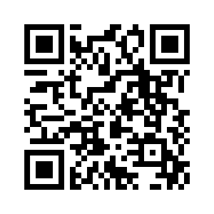

# Tonight, you're going to learn a new programming language

Bored of the same old stuff? Ready to shake things up? Well, that's exactly what we're gonna do!

We've got a super cool session lined up for you. It's like a wild experiment where we'll all dive into a brand new programming language from scratch. And the best part? We're keeping the language a secret 'cause that's half the fun! 😉 What we can tell you is that we're gonna have a blast working together, sharing the experience, and learning from each other.

Don't miss out on this crazy ride! Oh, and don't forget to bring your laptop. HackNight = Hands-on hacking madness!


## URLs

### Languages form

https://tinyurl.com/known-langs

### Languages QR



## Challenges

## 1. Warming-up: Hello world!

That's it. Earn your pizza slice 🍕

## 2. Currency Converter

Read the file at `data/exchange_rates_usd.json` and create a exchange rate convertes. Notice that rates in the file give the change from `USD` to another currencies, and values are not updated with today's prices.

There are two use cases to cover here:

- Convert any currency amount to `USD`. For instance `42 AUD` should convert to `42/1.3911 = 30.19 USD`.
- Convert any currency to another currency, by using `USD` as proxy. For instance `42 AUD` converts to `(42/1.3911) * (0.8927) = 26.95 EUR`

## 3. Quality Check

In the folder `data`, there's a dataset containinig different payments. We're asking to filter out the list, detecting payments with the following errors:

1. Negative amounts (2 points)
2. Empty payer name (2 points)
3. Not valid credit card format (5 points)

Additionally, we would like you to compute a simple statistic: _the top-ten countries with more payments_ (5 points).

There are different sizes available, we recommend starting with the file having only 100 payments, and then move over the 1 million one, `payments-1M.jsonl.gz`.

We'll give 5 extra points to the team processing 1 million payments under a second.

The files are in (json-lines format)[https://jsonlines.org/]. Definitely not the best format, but we want to make the night funny. The structure looks like this:

```bash
$ gunzip -c payments-1M.jsonl.gz | head -n 1 | jq
{
  "id": "bb652941",
  "ean": "90212741",
  "amount": 42.85,
  "product": "Incredible Plastic Computer",
  "vendor": "Walmart",
  "currency": "USD",
  "payer": {
    "name": "Ervin Jast",
    "email": "bryant@bednar.example"
  },
  "credit_card": "564012297698",
  "card_type": "solo",
  "country": "BL"
}
```

## 4. Volatility

The _Volatility_ of a stock gives us a measure on the amount of uncertainty given the changes made over time. Normally, it is computed using the standard deviation over the logarithmic returns.

The daily volatility for a given period of returns `P` can be defined as:

$\displaystyle \sigma _{\text{P}}=\sigma _{\text{daily}}{\sqrt{P}}$

Therefore, to calculate the volatility for one month, we just have to compute the standard deviation over the returns of that month, having `P` trading days:

```python
from math import sqrt
from sample_data import stock_prices

prices = pd.read_csv('./data/prices.csv', index_col=[0,1], parse_dates=[1])
msft = prices.loc['msft'].copy()

time_slice = msft.Close['2016-03-30':'2016-04-29']
std_dev_returns = time_slice.pct_change().std()
trading_days = len(time_slice)

volatility = std_dev_returns * sqrt(trading_days)
```

This gives us notion on how far the price might deviate from the average, in this case a 8.54%.
